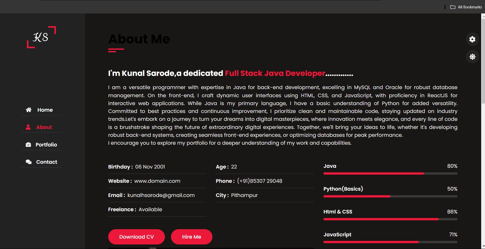

 

## About The Project

It is my personal portfolio...https://kportfolio-8e866.web.app/

## Built With

HTML,CSS and JavaScript

## Getting Started

To get a local copy up and running follow these simple example steps.

## Usage

we can start and stop the bike only from mobile application..

## Contributing

Contributions are what make the open source community such an amazing place to be learn, inspire, and create. Any contributions you make are **greatly appreciated**.
* If you have suggestions for adding or removing projects, feel free to [open an issue](https://github.com/kunal062001/Personal Portfolio/issues/new) to discuss it, or directly create a pull request after you edit the *README.md* file with necessary changes.
* Please make sure you check your spelling and grammar.
* Create individual PR for each suggestion.
* Please also read through the [Code Of Conduct](https://github.com/kunal062001/Personal Portfolio/blob/main/CODE_OF_CONDUCT.md) before posting your first idea as well.

### Creating A Pull Request

1. Fork the Project
2. Create your Feature Branch (`git checkout -b feature/AmazingFeature`)
3. Commit your Changes (`git commit -m 'Add some AmazingFeature'`)
4. Push to the Branch (`git push origin feature/AmazingFeature`)
5. Open a Pull Request

## Authors

* **Kunal Sarode** - *Software Developer* - [Kunal Sarode](https://github.com/kunal062001/) - **

